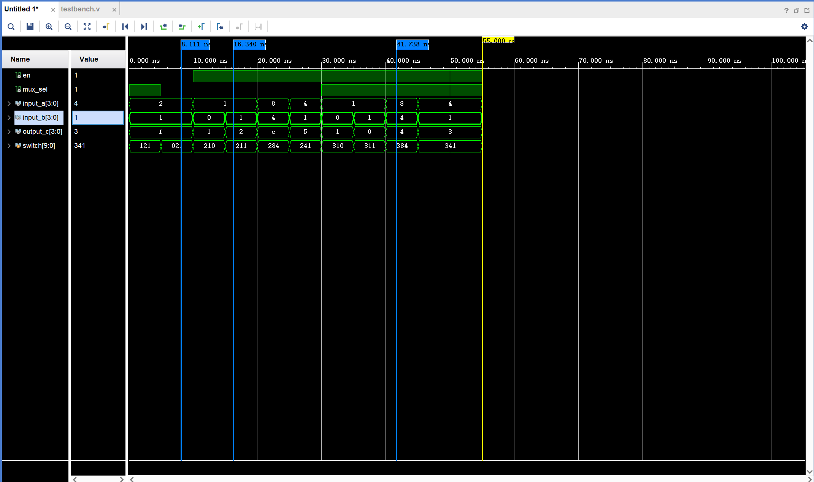
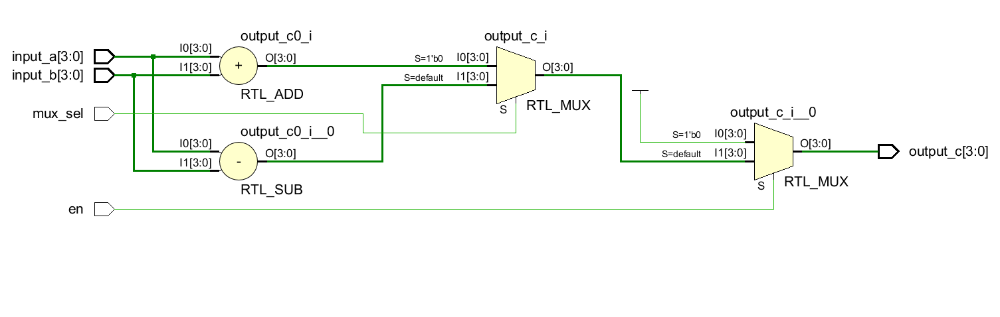
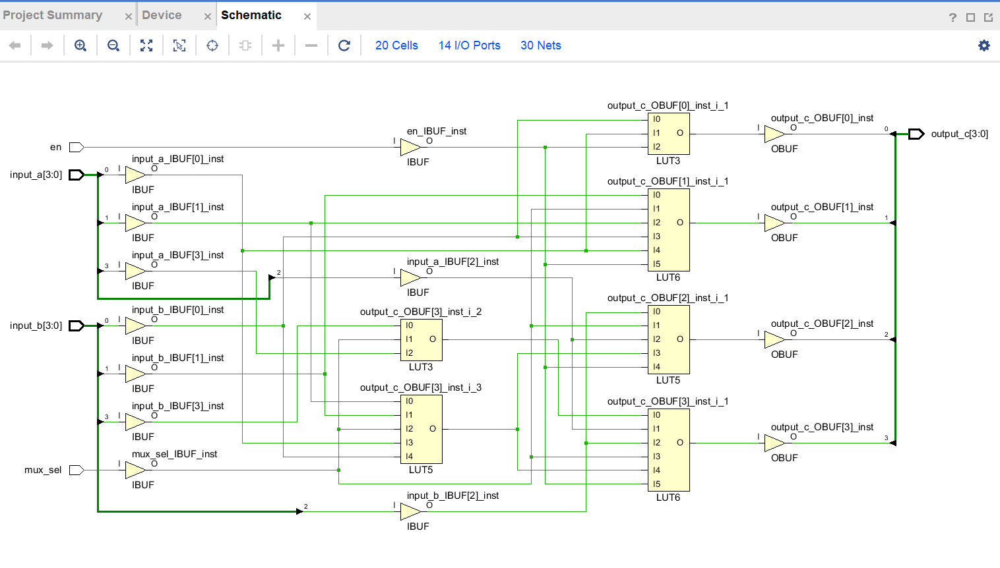

  <h1>实验 1：Vivado 使用与组合电路</h1>

  <strong>姓名</strong>：xx
  <strong>学号</strong>：114514
  <strong>班级</strong>：计算机与电子通信x班

## 一、 多路复用器仿真波形分析

### 1.2 仿真波形截图

### 1.3 波形分析

在 8.111ns 时 使能端 en=0,多路复用器不启用,所以 output_c 为 f 。

在 16.340ns 时 , en=1 mux_sel=0, input_a=1,input_b=1 ,output_c=2,符合当 en=1 的时候 ,启用多路复用器 ,mux_sel=0 选择加法(a+b),所以 output_c=2 。

在 41.738ns 时 , en=1 mux_sel=1, input_a=8,input_b=4 ,output_c=4,符合当 en=1 的时候 ,启用多路复用器 ,mux_sel=1 选择减法(a-b) ,所以 output_c=4 。

## 二、多路复用器电路图

### 2.1 RTL Analysis（RTL 分析图）截图

### 2.2 Synthesis schematic（综合后电路图）截图

## 三、 回答问题

### （1） 比特流文件（.bit 文件）默认在 Vivado 工程的哪个子目录下？

**回答**：mux/mux.runs/impl_1 目录下。文件名是 mux.bit

### （2）以指导书所给的 3-8 译码器工程为例，若芯片型号选成 xa7a12tcpg238-2I 是否可以？

**回答**： 不可以, 在 “生成比特流” 环节中会报错,出现的错误是: pin.xdc 文件出现错误,而这个错误来源于我们选错了芯片 ,最后导致比特流生成失败。

如果要修改芯片型号,在 vivado 的左边栏中,点击 settings ,然后在 "project device" 一行点击三个点，搜索对应的芯片进行修改即可，最后点击 "apply"

