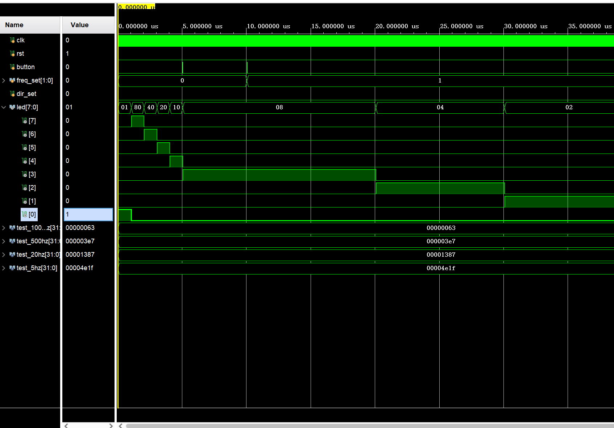
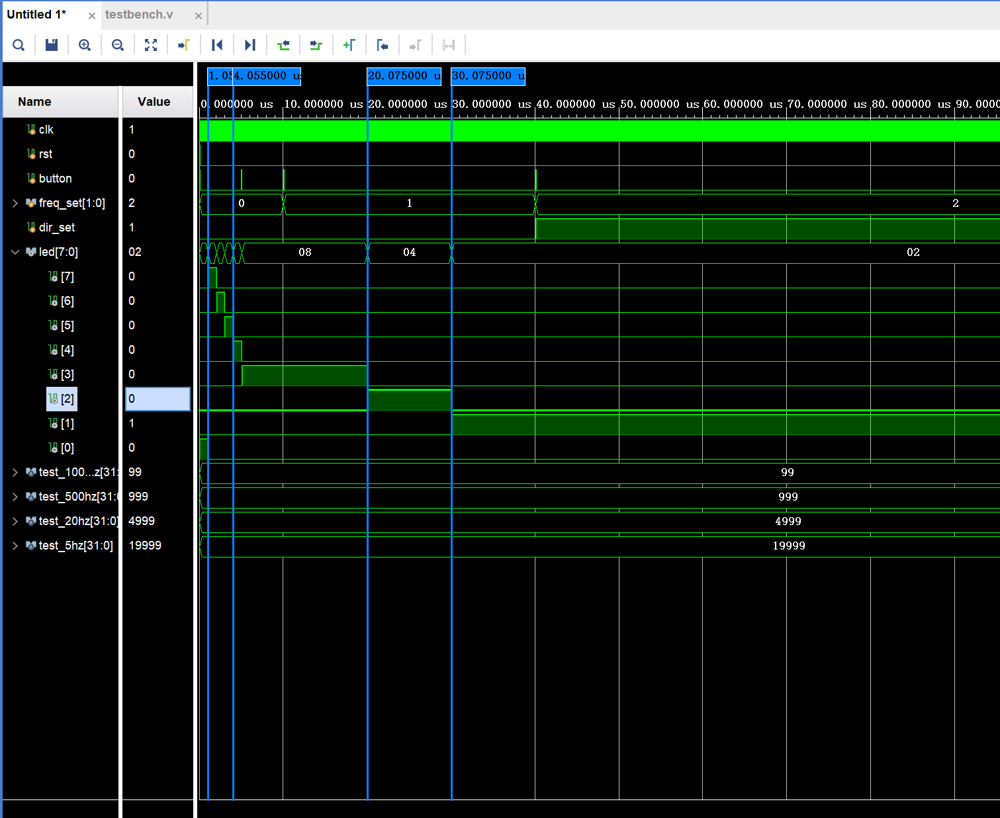
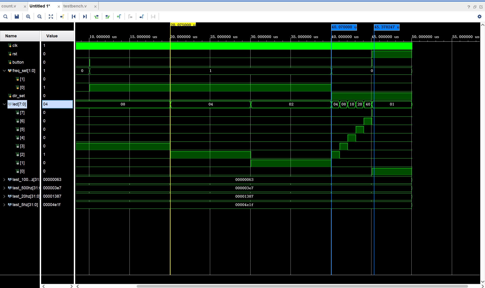
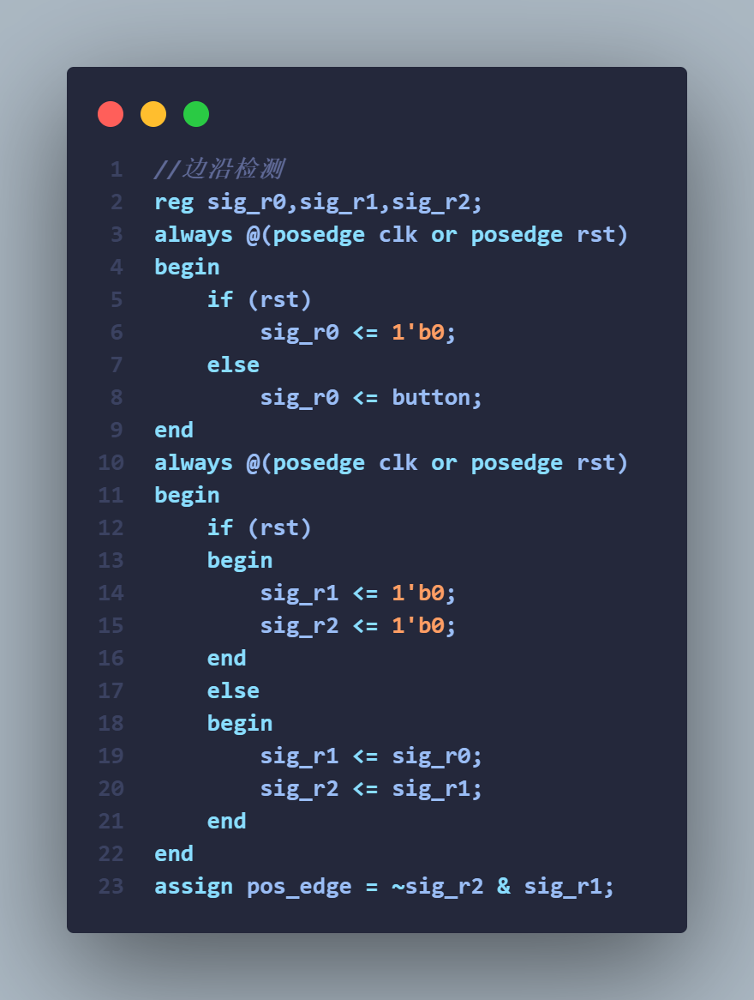
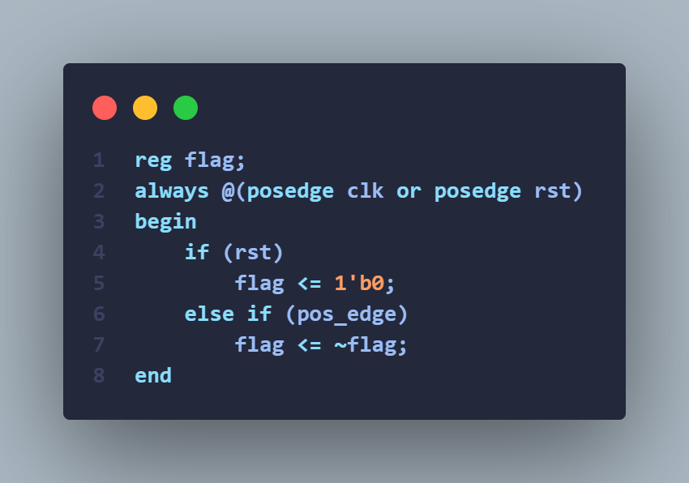
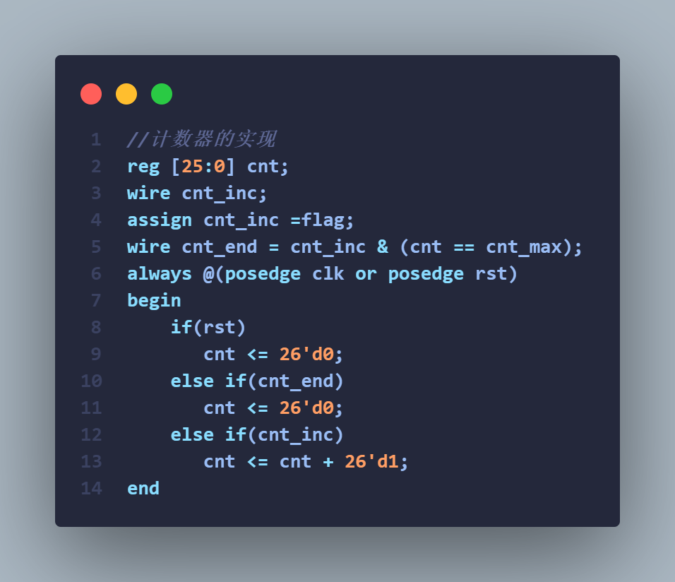
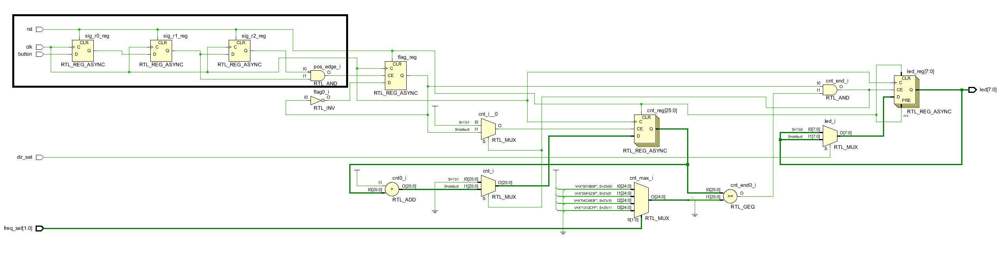
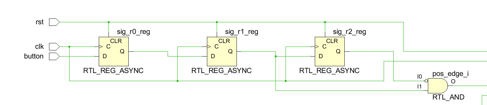

# 实验 3：计数器

**姓名**：刘楷 **学号**：2024311278 **班级**： 计算机与电子通信七班

## 一、基于计数器的流水灯仿真分析

### 1.1 仿真波形截图

能正确清晰体现实验所要求的功能，可以截多个图
并体现计数器或者输出的led信号在某个频率下的周期测量

### 1.2 波形分析

需体现初始复位、启动、暂停、间隔切换、方向切换，间隔和方向切换只需要体现一次。

---

根据第一张图，初始 rst 信号为 1，流水灯只有 led[0] 为1，其他均为0，说明 ，**初始复位功能** 正常。

--- 

根据第二张图，在按下button时，button信号变为1，流水灯开始工作，第一个和第二个 marker 之间三个周期，正好相差 3000ns，与 1000k Hz 频率相符。此时，两次button按下之间，流水灯之间 5000ns之间没有工作，说明 **启动和暂停功能** 正常，在第三次 button 按下之后，流水灯以 100k Hz 频率工作，在看第三个和第四个 marker 之间相差一个周期，正好相差 10000ns，符合 100k Hz 频率，说明 **间隔切换功能** 正常。

---

根据第三张图，第一个marker,dir_set变为1，变为左移，说明 **方向切换功能** 正常。看第二个marker，rst变为1，流水灯恢复初始状态，只有 led[0] 为1，说明 **复位功能** 正常。

## 二、关键代码

尽管已经提交了代码文件，仍要求给出以下关键代码及说明，其他模块代码无需粘贴，注意排版，最好直接截图

### 2.1 3 个寄存器级联实现边沿检测的代码

**说明** 采用三级寄存器级联方式，在每个时钟上升沿，信号会逐级向后传递。第一级寄存器负责锁存来自button的输入电平；第二级寄存器锁存第一级寄存器往前一个时钟沿到来时的输入电平；第三级寄存器再锁存第二级寄存器往前一个时钟沿到来时的输入电平。
因为这个时候，第二个寄存器和第三个寄存器的结果较为稳定，最后通过第二个寄存器和第三个寄存器的输出结果，得到 button 的上升沿检测信号 pos_edge。

### 2.2 按键 S2 启停的实现的代码

贴出关键代码，并简要说明按键S2对应的信号如何控制计数器启停

**说明**：由第一张图和第二张图，每次 button 按下,pos_edge 变为 1，flag 翻转，根据第三张图，flag 为 1 得时候，cnt_inc 为 1，计数器开始计数；flag 为 0 的时候，cnt_inc 为 0，计数器停止计数。

## 三、流水灯 RTL Analysis 截图

需用红框准确标记边沿检测三级寄存器级联的位置

放大如下：

## 四、计数器最大值的计算

    时钟频率100MHz，给出流水灯某一个频率对应的计数器变量cnt应达到的最大值的计算过程，cnt从0开始，流水灯频率自行选定。

流水灯的频率是100hz，间隔周期为0.01s，时钟频率为100MHz，即10ns一个时钟周期，$N=\frac{0.01s}{1 * 10^{-8}}=1000000$ ,同时由于cnt是从0开始计数，当cnt达到 N-1 的时候，触发流水灯移位，然后cnt归零，所以最大值应该是N-1=999999。
