# 实现二：寄存器

**姓名**：xx **学号**：114514 **班级**：计算机与电子通信x班

## 一、寄存器文件仿真分析

### 1.1 仿真波形截图

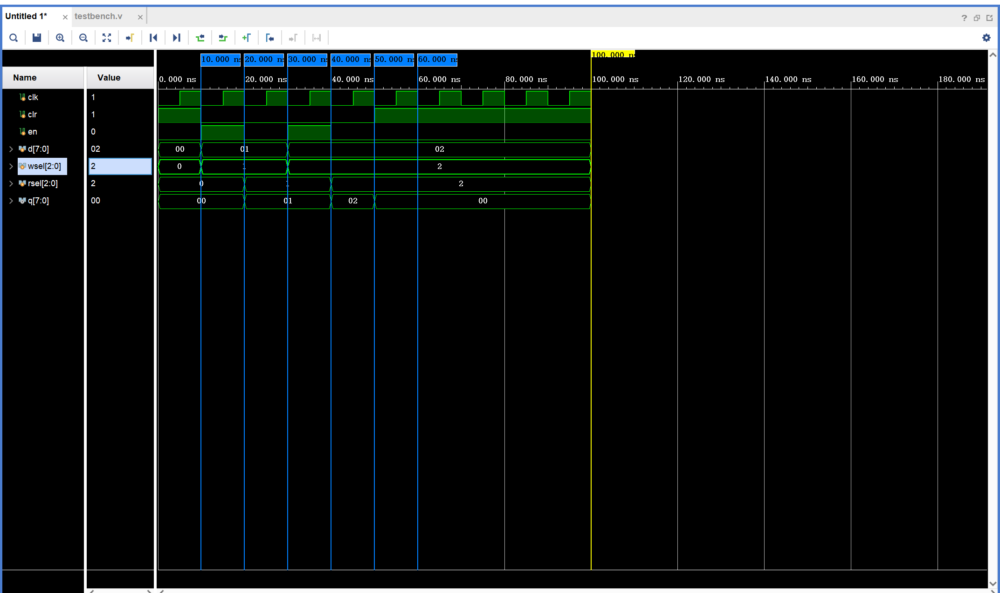

### 1.2 波形分析

**功能和信号说明：**
功能是 8 个 8 位寄存器，信号输入是：clr,en,d[7:0]，wsel[2:0],rsel[2:0],信号输出是 q[7:0]

**波形分析说明**：

- 寄存器初始复位：第 1 个时钟周期（0-10ns），clr 为 1 处于复位态，输出 q 一直为 0。
- 寄存器同步写入：第 2 个时钟周期（10ns-20ns），clr 为 0，en 为 1，wsel=1，写入一号寄存器，输入 d 变为 1
- 寄存器读取：第 3 个时钟周期（20-30ns），clr 为 0，en 为 0,q 变为 1
- 30-50ns 的时钟周期，寄存器第二次读取，和前面的过程一样,q读取的数据变为2
- 寄存器异步清零：60ns,时钟下降沿时，clr 变为 1，输出 q 在复位 clr 变为 1 的同时立刻变为 0，属异步清零。

## 二、电路图

### 2.1 D 触发器的 RTL Analysis 和 Synthesis schematic 截图

RTL Analysis 截图
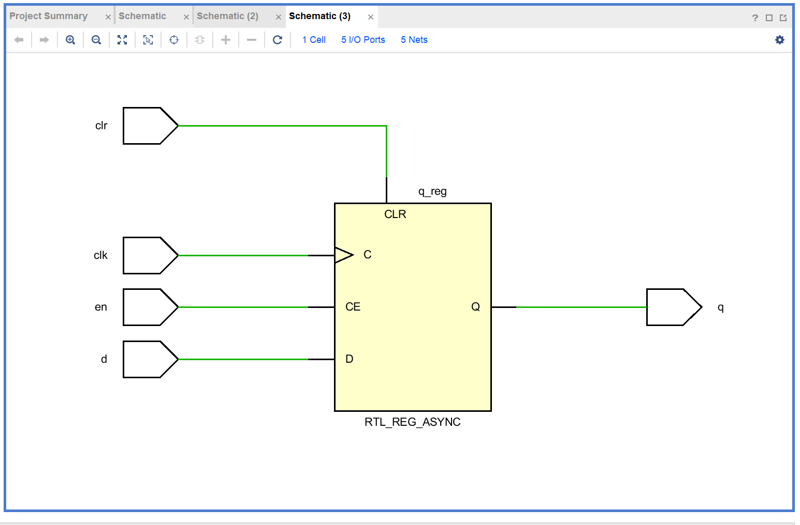
Synthesis schematic 截图
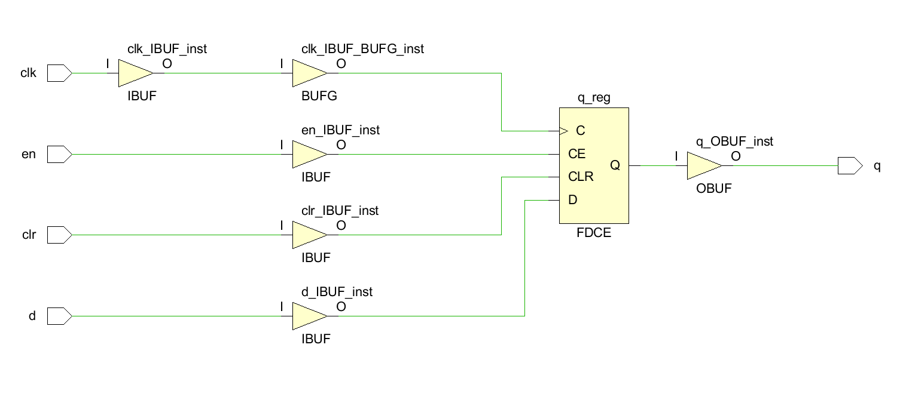

### 2.2 寄存器文件的 RTL Analysis 和 Synthesis schematic 截图

- 寄存器文件 Synthesis schematic 图较复杂，只需整体截一张图，不用放大截多张

RTL Analysis 截图
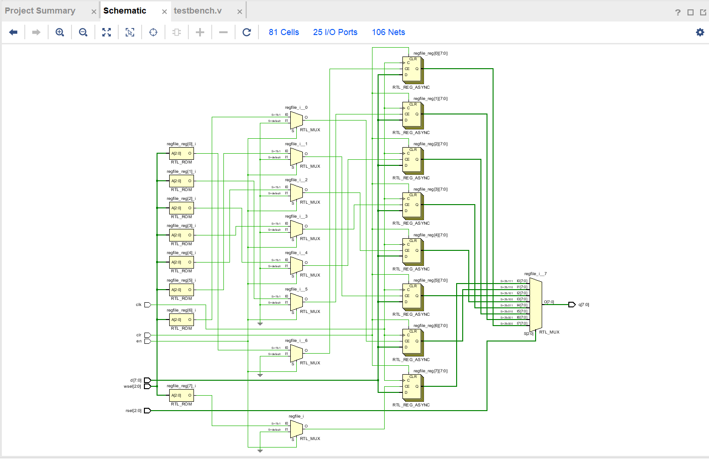
Synthesis schematic 截图
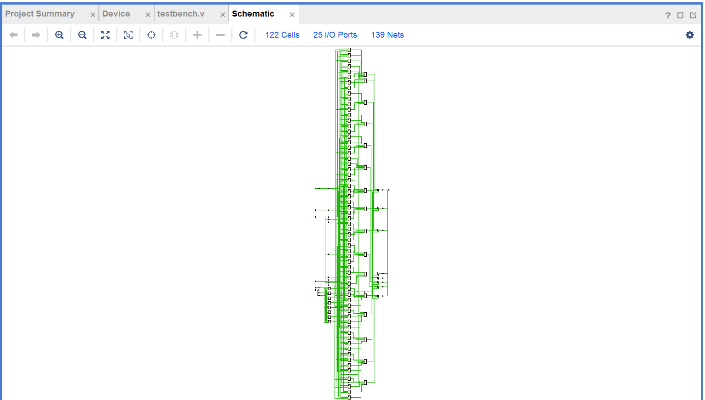

### 三、作业

阻塞赋值的 RTL 分析图，综合后电路图，仿真波形截图

非阻塞赋值的 RTL 分析图，综合后电路图，仿真波形截图

| lab2         | ex1_block（阻塞赋值） | ex1_nonblock（非阻塞赋值） | 结论             |
| ------------ | --------------------- | -------------------------- | ---------------- |
| RTL 分析图   | 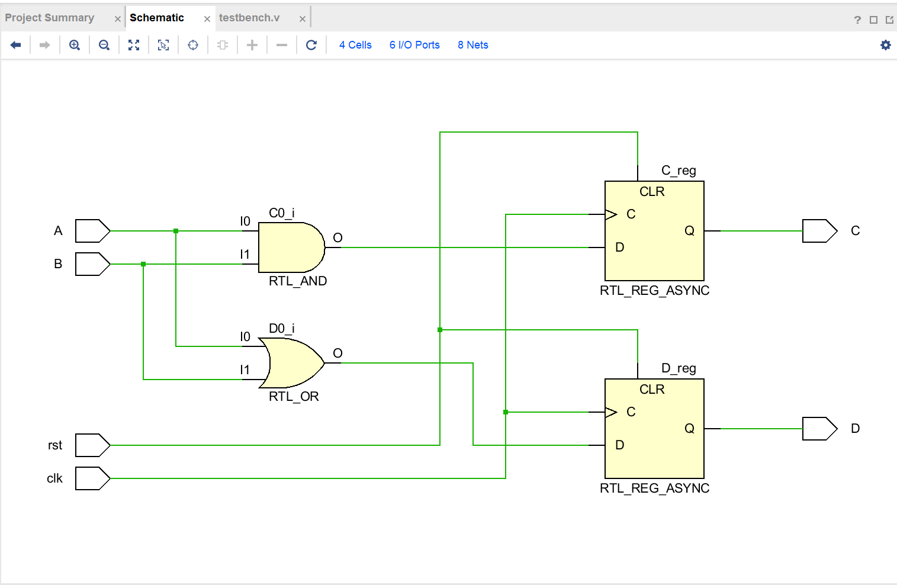      | 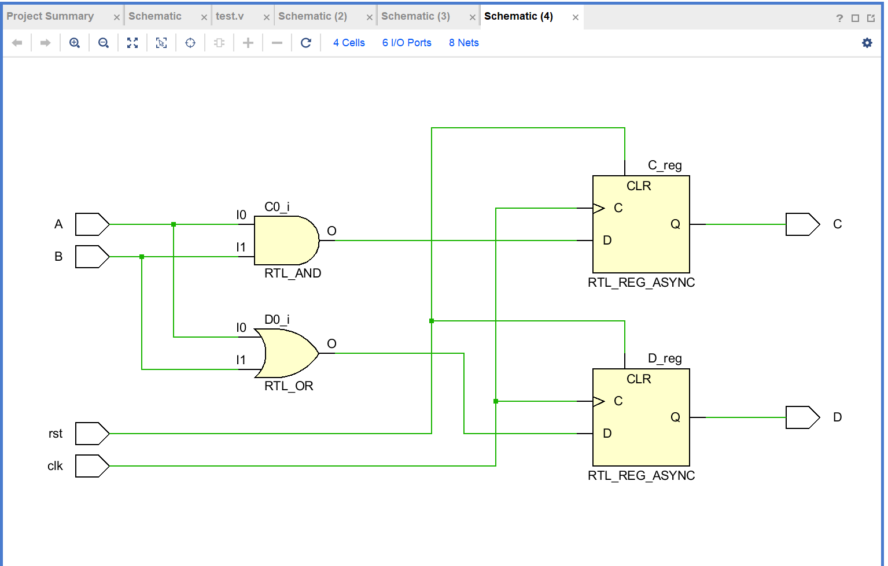          | RTL 分析图相同   |
| 综合后电路图 | 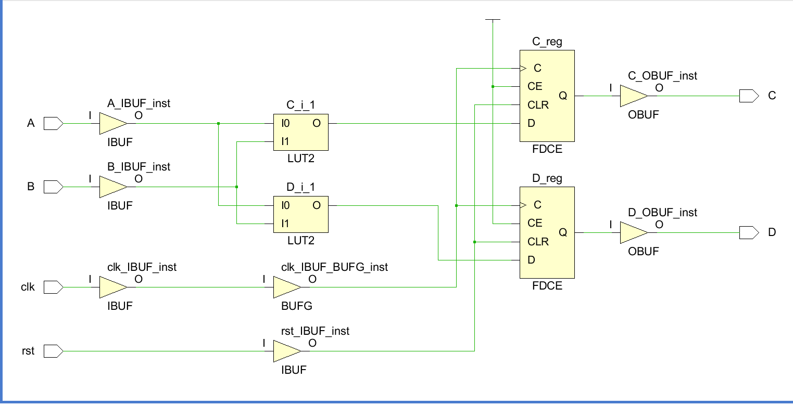      | 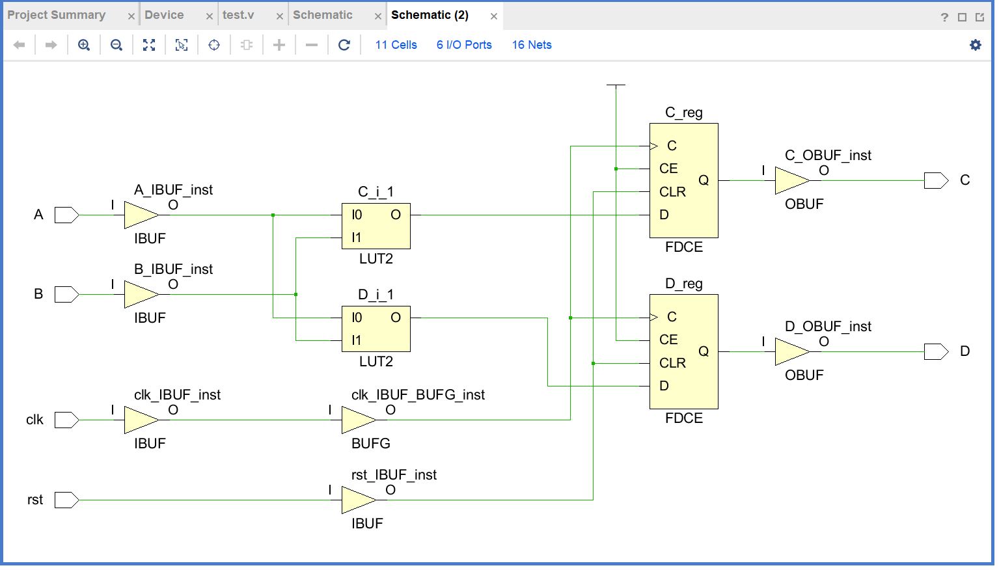          | 综合后电路图相同 |
| 仿真波形截图 | 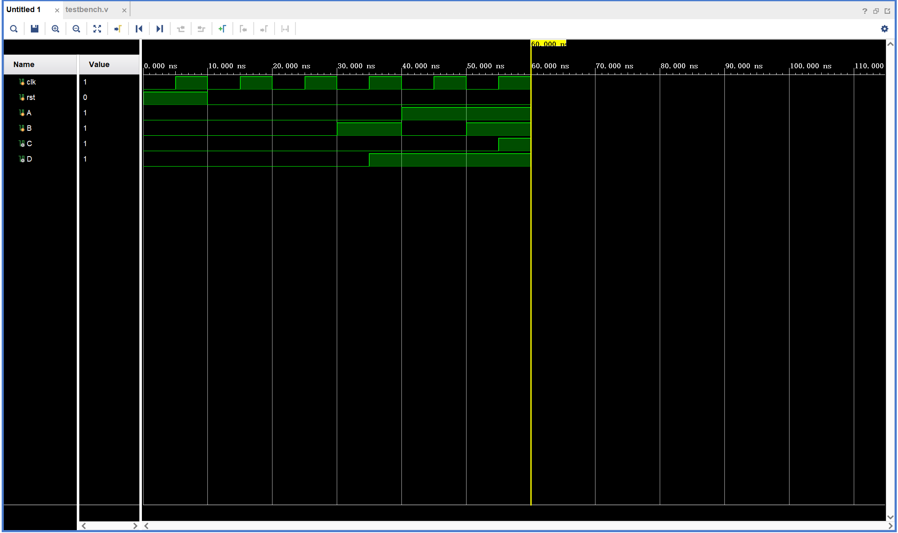      | 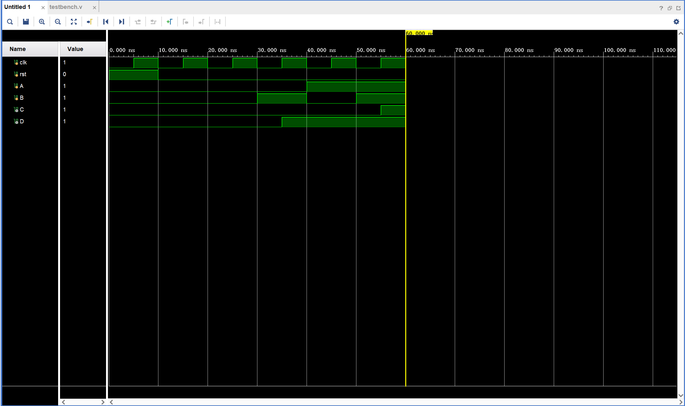           | 仿真波形截图相同 |
