# 实验五：状态机

**姓名**： **学号**： **班级**：

## 一、串口软件接收到的数据截图

请截图不要用手机拍照，需清晰的体现接收到的数据

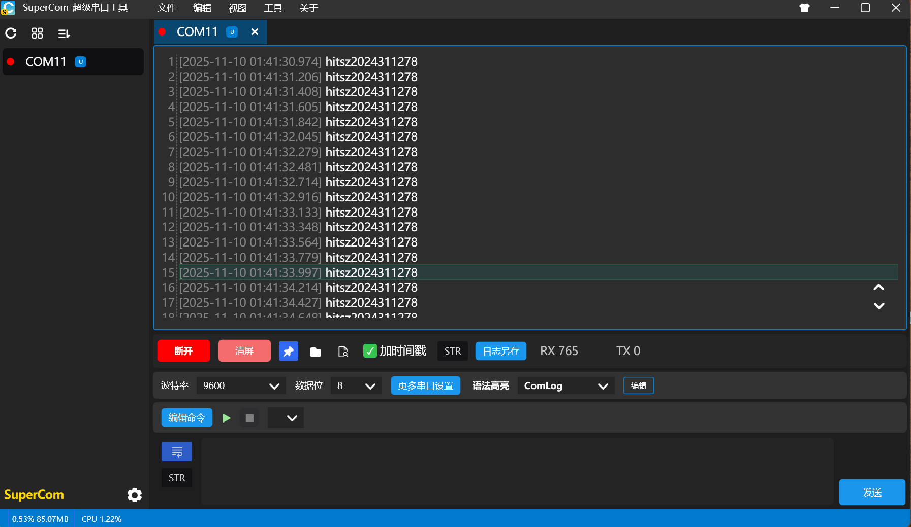

## 二、状态转移图

- 要求清晰的电子版，画图软件不限，比如visio、draw.io、ppt、飞书等
- 关键要求参考实验课件上的状态图，要求体现：复位时进入初始状态，状态机闭环，转移条件和状态输出要正确、全面，
    若输出信号较多不方便画在图中可用文字说明
- 涉及的信号需说明含义

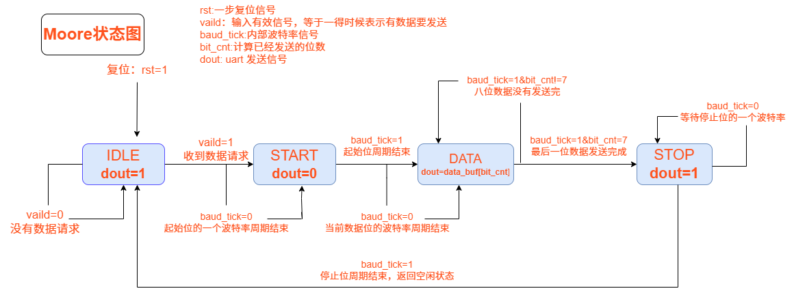

## 三、仿真分析

### 3.1 仿真波形截图

    能正确清晰体现所要求的功能，要体现模块内部状态变量对应的信号

### 3.2 波形分析

    UART发送核心功能的波形分析，覆盖一个完整数据帧，需体现状态机输入、现态、次态、输出等完整要素，与状态图要一致    

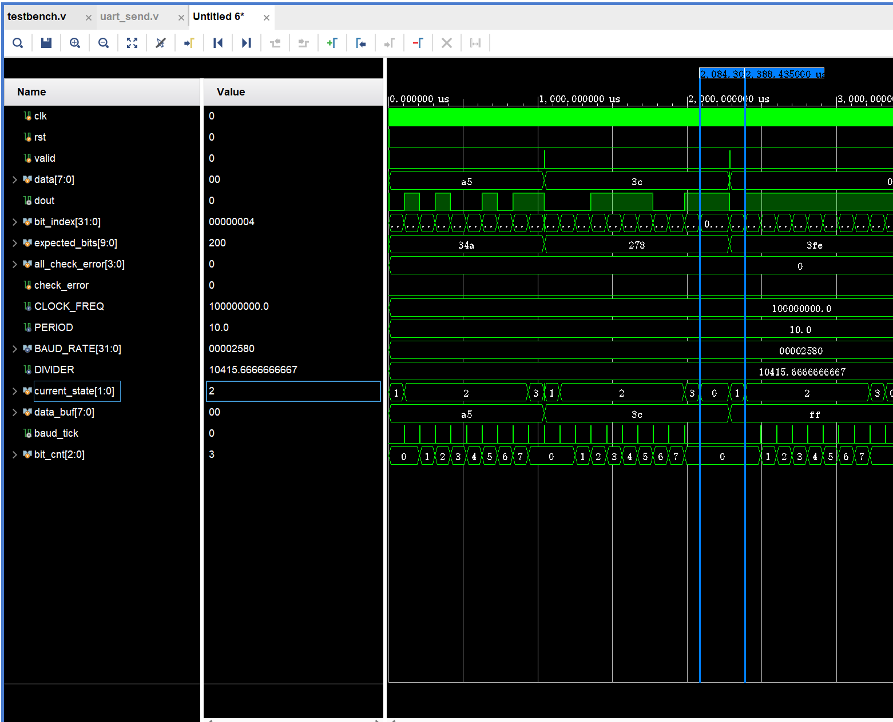

- 第一张图:  IDLE 空闲状态 ---> START 起始状态

在第一个和第二个 marker 之间，valid=0的时候，current_state保持为 IDLE ，dout一直为1，当valid=1(中间出现valid高电平)的时候，状态由IDLE转移到START，dout变为0，表示起始位。

- 第二张图:  START 起始状态 ---> DATA 数据状态
  
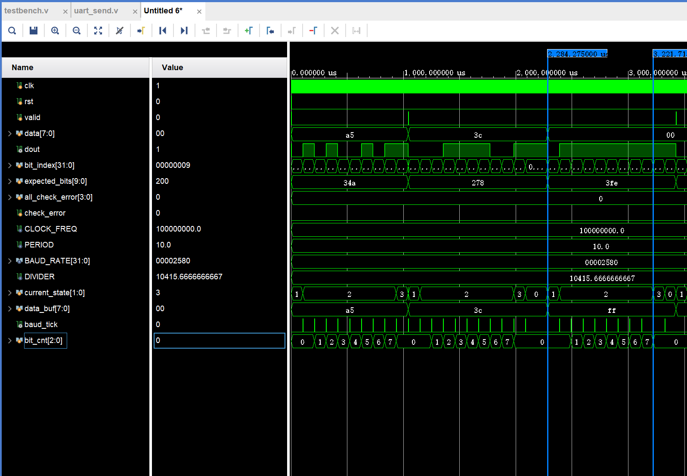
在第一个和第二个 marker 之间，当起始位周期没有结束时(baud_tick=0)，dout保持为0，当baud_tick=1,状态转移到DATA状态，dout变为数据的最低位1。 (data=8'b11111111)

- 第三张图:  DATA 数据状态 ---> STOP 停止状态

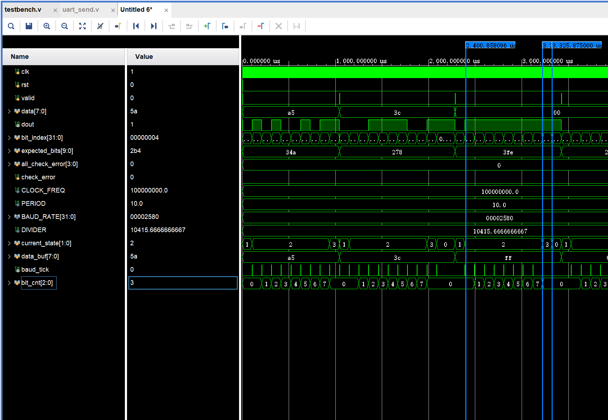

在第一个和第二个 marker 之间，bit_cnt在每次baud_tick=1的时候加一，从0变到7，持续发送数据，current_state保持为2,dout持续发送1。这表明当数据位周期没有结束时，dout保持为当前数据位，在数据位周期结束且数据尚未发送完成(baud_tick=1 & bit_cnt!=7)，继续返回 DATA 状态发送数据。在第二个和第三个 marker 之间当数据位周期结束且数据发送完成(baud_tick=1 & bit_cnt==7)，current_state变为3，表明状态转移到STOP状态，dout变为1，表示停止位。

- 第四张图:  STOP 停止状态 ---> IDLE 空闲状态

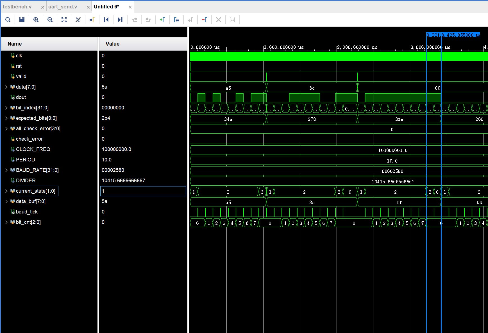

在第一个和第二个 marker 之间，baud_tick=0的时候，current_state保持为3，dout保持为1，这表明在STOP状态下，当停止位周期没有结束时，dout保持为1，然后当baud_tick=1的时候，current_state变为0，dout保持为1，表明在停止位周期结束后，状态转移到IDLE状态，dout继续保持为1，表示空闲状态。

## 四、RTL 分析

### 4.1 RTL Analysis 截图

    - uart_send模块RTL图，并要求以红框标记状态机的状态寄存器、转移逻辑、输出分别在图中的位置，可以分开截多个图
    - 打开RTL图后点击uart_send模块即可查看uart_send模块内部的RTL图

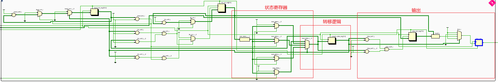

**状态寄存器**

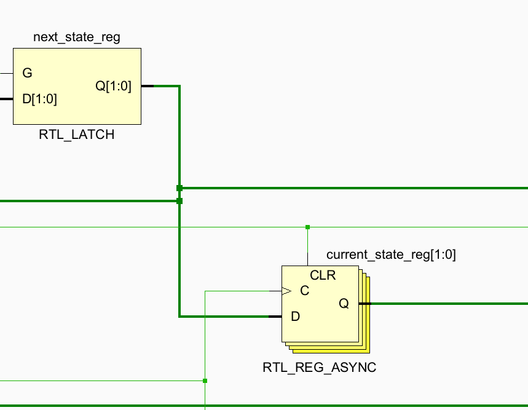

**转移逻辑**

**输出**
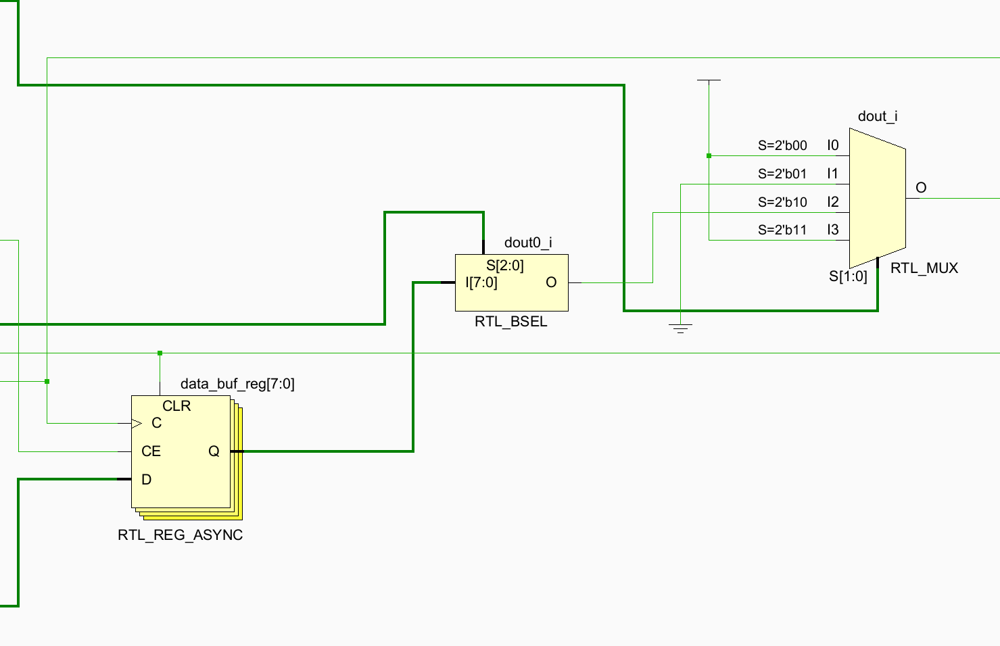

### 4.2 Linter 报告截图

截图需要体现工程名或者工程路径，体现是该实验的Linter报告

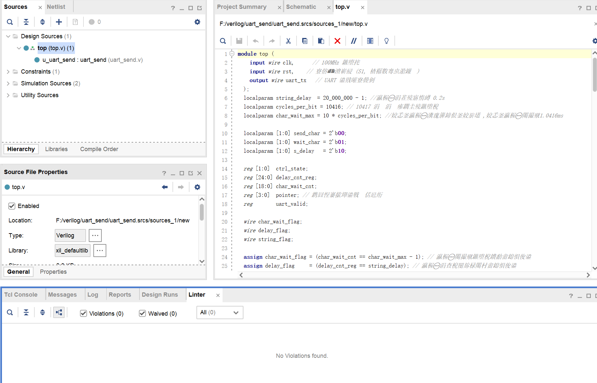

## 五、查看指导书请回答

### 5.1 如果仿真波形图中，非复位阶段，信号出现了 X 或 Z，出现的原因可能有哪些？请简要说明。

- X 是不定态，如果在非复位阶段出现不定态，是 reg 类型的变量在读取之前从未被赋值。在仿真开始时，每个寄存器类型除非有明确初始值或者被复位信号设置了，否则都会出现 X 状态。

- Z 是高阻态，一般出现在 wire 类型的信号没有任何逻辑驱动它，或者说信号由一个三态门控制，使能信号为无效的时候，导致输出为高阻态。

### 5.2 功能仿真在默认时间内结束，发现仿真时间不够，要继续运行指定时间，要怎么操作？可以文字或截图说明。

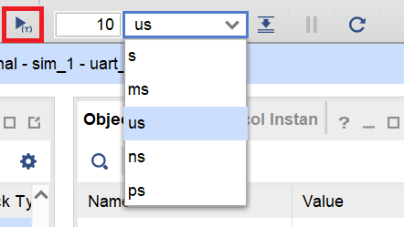

在右边的格子可以调整时间的单位，左边的格子可以调整仿真的时间，调整好了之后，点击红框中的开始按钮，重新仿真，就可以看到指定时间的波形了。

### 5.3 功能仿真窗口默认只打开被仿真顶层模块定义的信号，如果要查看子模块内部信号的波形要怎么操作？可以文字或截图简要说明。

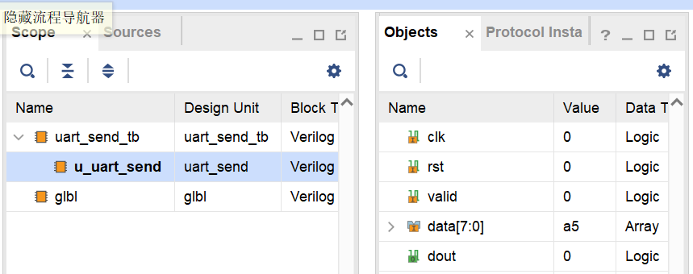

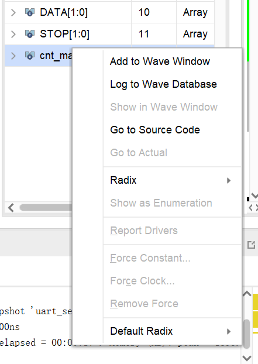

在图中的 scope 中，点击你想查看的子模块文件名，然后就会出现右边的 objects 栏，右击你想查看的信号,出现第二张图的菜单，选择“Add to Wave Window”就可以把该信号添加到波形窗口中,r 然后重新运行就可以查看了。
