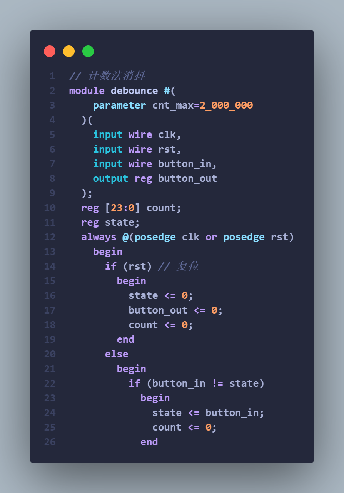
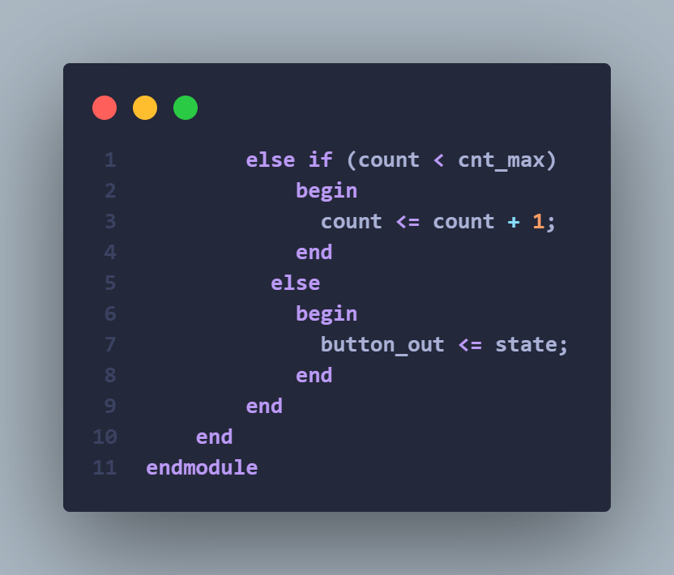
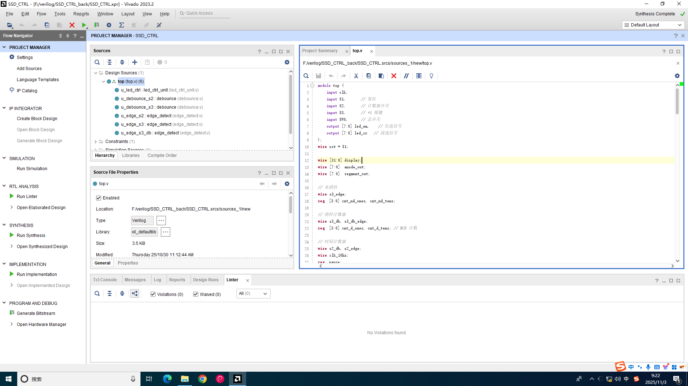
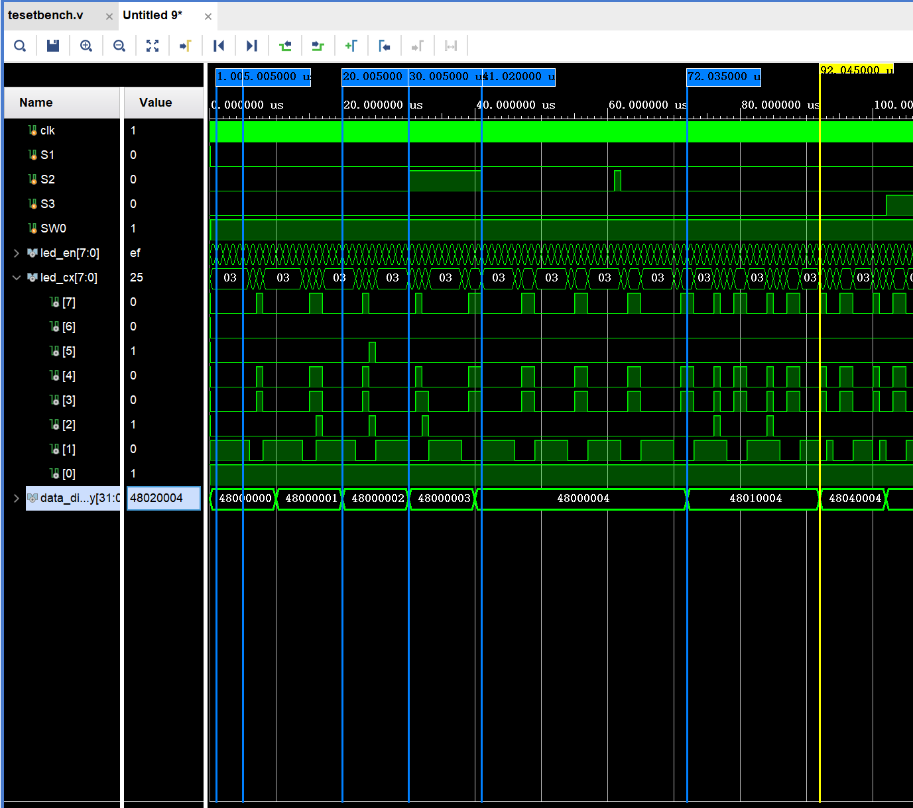
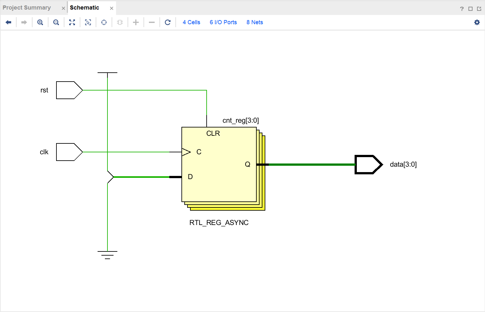
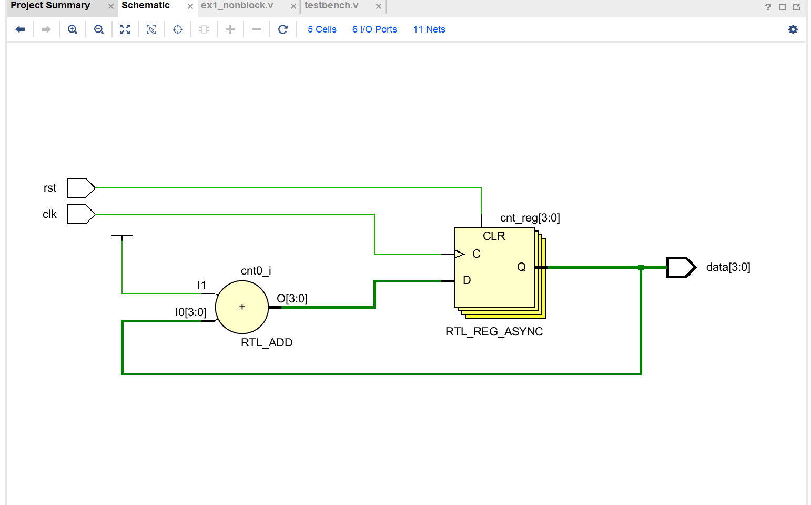
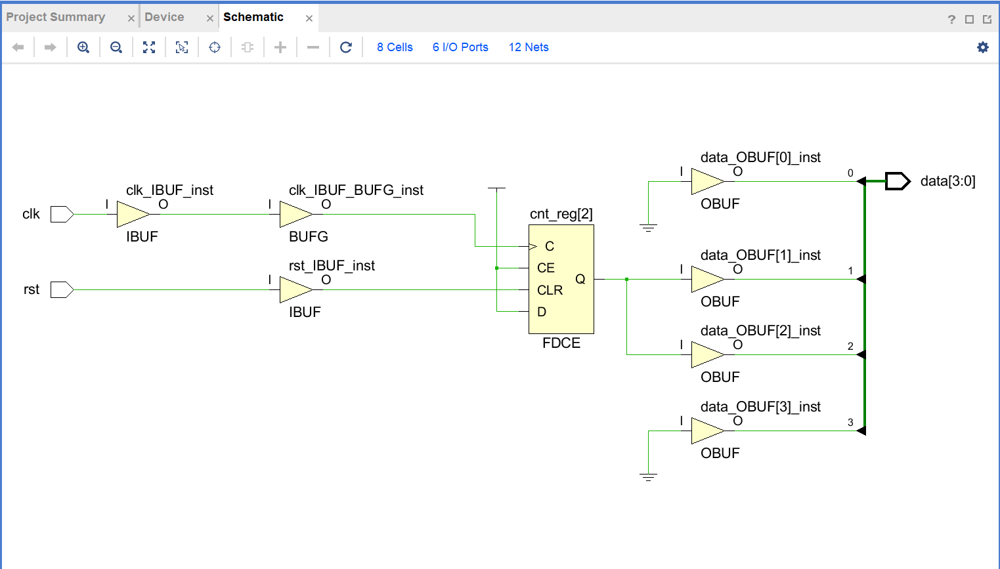
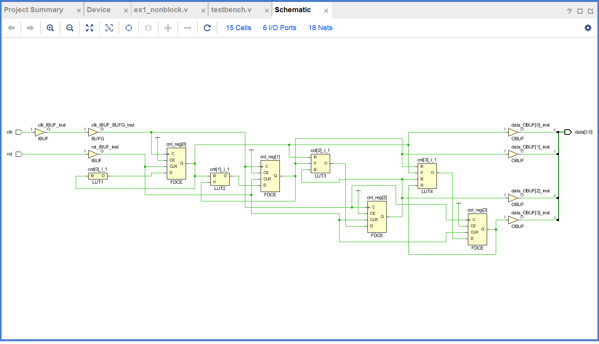
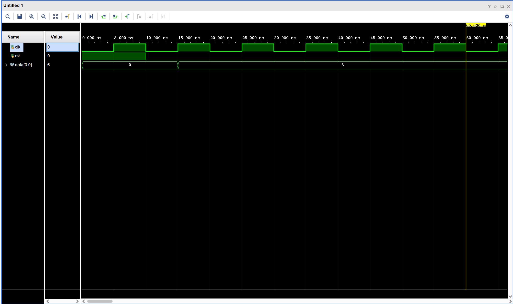
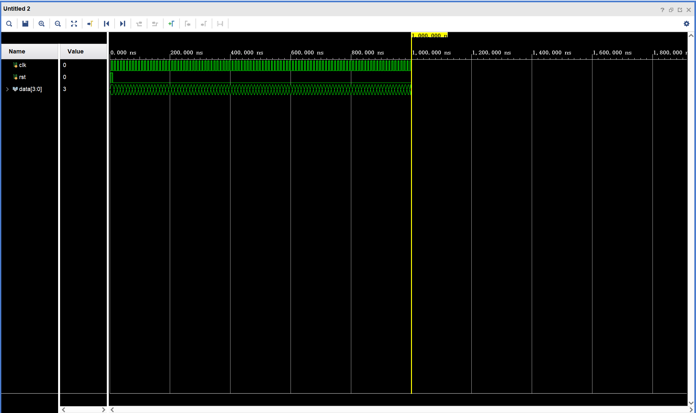

# 实验 4：数码管控制器

**姓名**：刘楷 **学号**：2024311278 **班级**： 计算机与电子通信七班

## 一、数码管控制器设计实现

### 1.1 本实验你的实现中有几个 Verilog 模块，列出具体的模块名和功能，含顶层模块

我的实验中一共有四个模块，其中包括一个顶层模块:

- top.v 主要负责连接各个子模块，实现整体功能
- debounce.v 负责实现按键消抖功能
- led_ctrl_unit.v 负责控制数码管的暗亮，同时将对应的数字转换为数码管显示的段选信号，然后输出到数码管上
- edge_detect.v 负责检测按键 S1,S2,S3 的上升沿信号

### 1.2 消抖的实现

贴出对应的代码，并简要说明实现方法和思路

**方法思路**：rst=1 的时候，所有变量清零。无论是真是的按动或者是毛刺，当 button_in 与我们暂存的 state 不一样的时候，说明信号发生了变化，将 button_in 的状态存入 state,然后 count 清零，count 开始计数，只有当 count > cnt_max 的时候，才说明信号足够稳定，不是毛刺什么的干扰信号，才将 state 的状态赋值给 button_out 输出，这样实现了计数法的消抖功能。

### 1.3 Linter 报告截图

截图需体现是实验 4 的工程或代码

## 二、数码管控制器仿真分析

### 2.1 仿真波形截图

- 能正确清晰体现所要求的功能，根据需要可以截多张仿真波形图

---

- 请在相关波形图下做对应的分析说明，或者明确指出分析说明对应哪张仿真截图

### 2.2 波形分析

- 按要求完成分析，数码管轮询、消抖、按键计数
- 数码管轮询，需体现一轮 8 个数据使能信号和段选信号的变化；
- 消抖，模拟一个带有抖动的按键波形输入，分析输出；
- 按键计数，只需体现 2 次消抖的计数即可；

**第一张仿真图片**: 首先 display 第一位和第二位一直显示 48，学号显示正常。第一个和的第二个 remarker 显示，led_en 四个周期过去了 4us，led_en 的值为 ef（8'b11101111），此时 led_cx 同步切换为 25（数字'2'的编码）;led_en 切换为 df（8'b11011111），led_cx 同步切换为 03（数字'0'的编码），两者同步变化，说明**数码管轮询**正常工作。

第三个和第四个 remarker 展现计数器的功能，其中计数一次，中间间隔 10us，工作正常。第四个和第五个 remarker 中间超过 10us ，使得计数器计数暂停，证明 S2 工作正常，而且在第五个和第六个 remarker 之间，模拟了一次毛刺，因为没有超过 10us，所以计数器依旧没有开始计数，说明 S2**按键消抖**功能正常。

**第二张仿真图片**：前三次 S3 的变化，模拟毛刺，均没有超过 10us，所以消抖计数器没有开始计数，说明 S3**按键消抖**功能正常。第四次 S3 的变化，持续时间超过 10us，所以计数器开始计数，无论消抖和不消抖计数器同时增加，说明 S3**按键计数**功能正常。

## 三、课后作业内容

### 3.1 请参照以下表格中的内容要求，对比“课后作业”中所给电路阻塞和非阻塞赋值的区别，所用截图要清晰。

| lab2         | ex1_block（阻塞赋值） | ex1_nonblock（非阻塞赋值） | 结论                                                                                                                                                                                                                  |
| ------------ | --------------------- | -------------------------- | --------------------------------------------------------------------------------------------------------------------------------------------------------------------------------------------------------------------- |
| RTL 分析图   |     |       | 两张图片不同，阻塞赋值实现的是 cnt 每次重新赋值为 6,而非阻塞赋值实现的是 cnt 在每次上升沿加一。                                                                                                                       |
| 综合后电路图 |     |       | 两张图片不同，因为阻塞赋值被实现为一个纯组合逻辑，cnt 一直赋值为 6，而非阻塞赋值被实现为一个时序逻辑，cnt 每次时钟上升沿加一。                                                                                        |
| 仿真波形截图 |     |       | 阻塞赋值中，语句是顺序执行，所以当 rst 为 0 的时候，等待 clk 上升沿的时候，cnt 直接赋值为 6，data 最后被赋值为 6；在非阻塞赋值中，每次时钟上升沿会读取旧值，同时只有最后一条赋值语句才会生效，所以 cnt 每次只会加 1。 |

### 3.2 针对 ex1_block 和 ex1_nonblock 两种实现，分别回答

一个时钟后 cnt 是多少，是 1 还是 6 还是 5？2 个时钟后的 cnt 是多少？

- 阻塞赋值中，1 个时钟后 cnt 是 6，2 个时钟后 cnt 是 6；
- 非阻塞赋值中，1 个时钟后 cnt 是 1，2 个时钟后 cnt 是 2；
